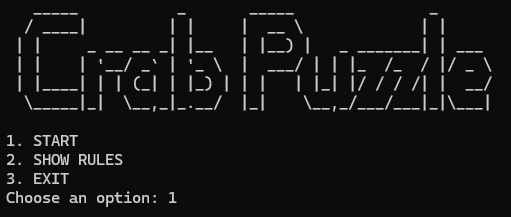
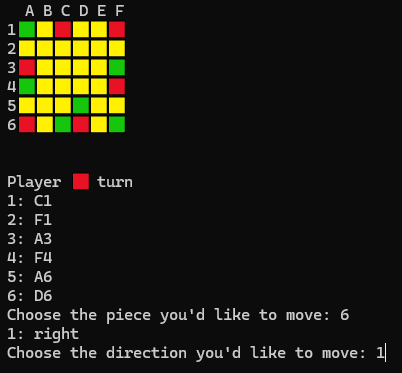

# 🦀 Crab Puzzle Rules

## Installing and playing

This is a python implementation of [Lost in Play](https://www.happyjuice.games/)'s Crab Puzzle Challenge

Prepare your virtual environment by running:

```bash
python -m venv env
```

Install the requirements:

```bash
python -m pip install -r requirements.txt
```

Finally, run:

```bash
python main.py
```

You're all set.

## Some screenshots




## Rules

### Objective:
The goal of the game is to align four dots of your color in a row either vertically or horizontally.

### Setup:
- The game board is a 6x6 grid.
- Each player has pieces represented by colored squares: 🟩 and 🟥.

### How to Move:
- On their turn, a player must move one of their dots.
- Dots can move in straight lines (vertically or horizontally) as far as possible.
- Movement stops when the dot reaches:
    - The edge of the board, or
    - Another dot (regardless of the owner).

### Winning the Game:
- The first player to align four dots in a row (vertically or horizontally) wins!
- Diagonal lines do not count.

### Game Flow:
- Players take turns moving one dot at a time.
- If no player aligns four dots, the game continues until a winner emerges.

### Tips:
- Block your opponent’s moves while setting up your own alignment!
- Plan your moves strategically to maximize mobility.